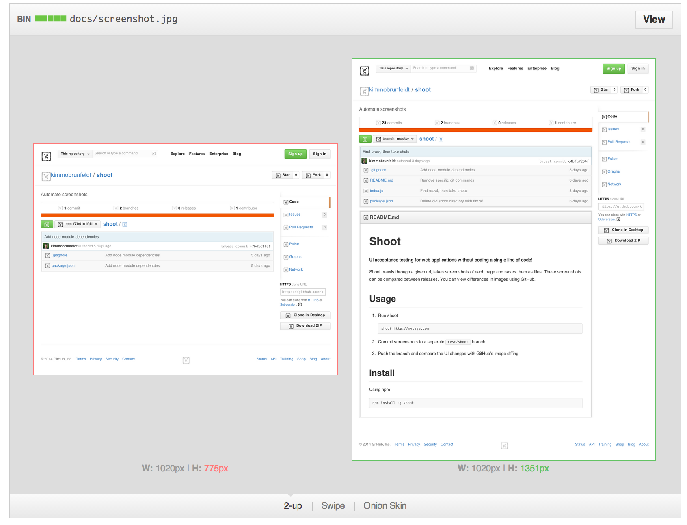

# Shoot - UI review for web applications

Shoot crawls through a given site, takes screenshots of each page and saves them as files.
These screenshots can be compared between releases.

*You will know exactly the visual changes you make*

## Example

Push shoot history to GitHub to see nice image diff view

## Usage

Easiest way to run shoot is to use the default *crawl* mode.

    shoot http://mypage.com

You can also specify a list of urls to shoot.

To see differences visually, you can for example push shoot's git repository to GitHub.

## Install

Using npm

    npm install -g shoot
